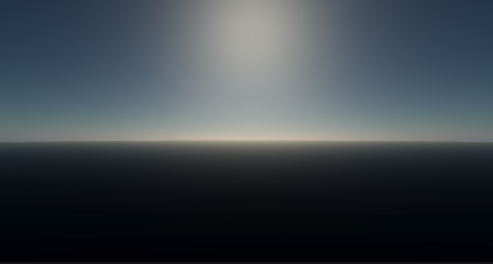
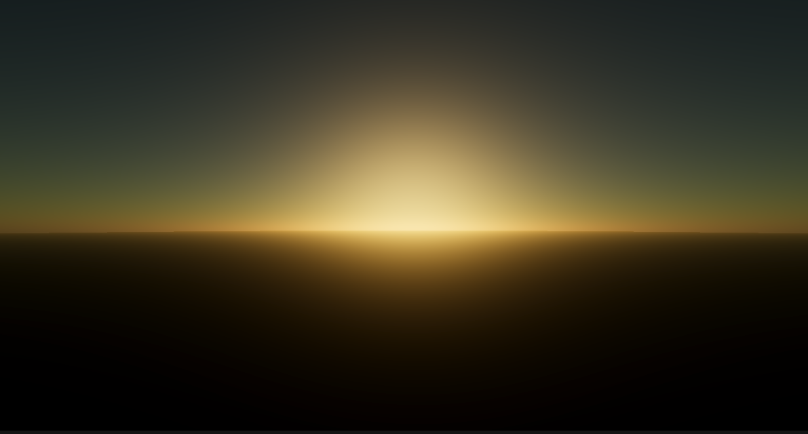
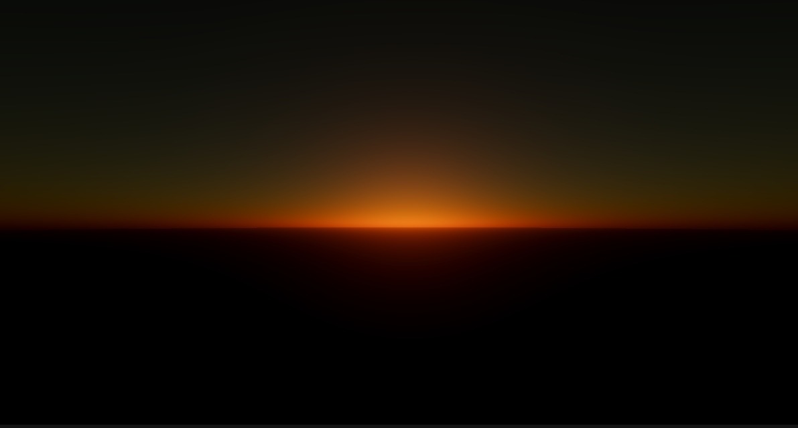

# 大气散射 AtmosphericScattering
项目环境：Unity 2021.3.39f1
渲染管线：Built - In （后续可能会写一个URP版本）
仅是个人用来学习项目，参考知乎作者[未名客](https://www.zhihu.com/people/wsqjny)
公式推导可以参考该作者，非常精彩，后续也会将我整理的笔记放在我的博客网站上。[飞的博客](https://scrx666.github.io/)

2025.1.21 - 实现实时大气渲染

